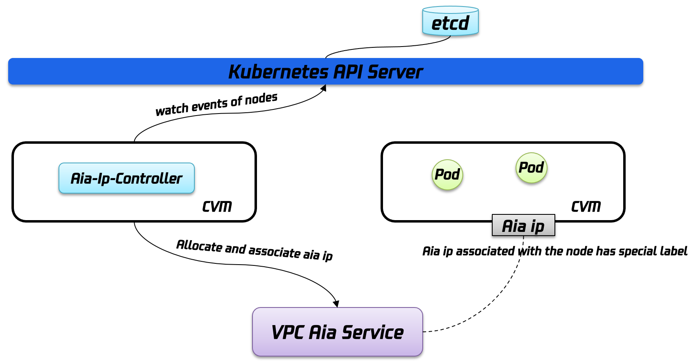
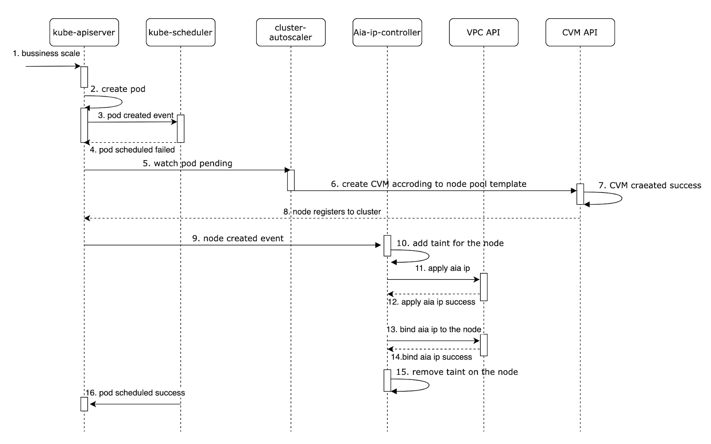

# AIA-IP-Controller

## Overview

Aia-ip-controller is a Kubernetes application, which make it possible for [Tencent Kubernetes Engine(TKE)](https://intl.cloud.tencent.com/product/tke) customers to leverage Tencent Cloud's [AIa Service](https://intl.cloud.tencent.com/product/aia) to accelerate network with global coverage. Aia-ip-controller monitor the Kubernetes cluster it is hosted on and will allocate aia ips and bind them with nodes in the cluster that has special label.

## Architecture

In general, Aia-ip-controller is a typical kubernetes controller hosted on cluster that watch nodes create/update/delete events, and then interact with [AIa Service](https://intl.cloud.tencent.com/product/aia) to allocate/bind aia ip for nodes that has a special label. We use label `tke.cloud.tencent.com/need-aia-ip: 'true'` by  default. If the label on the node matches the configured label:

- **Node created event watched**: Controller set a specific taint for the node to prevent user workloads from being scheduled on the node, and at the same time call the Aia Service API to create an ip resource and bind it to the node. After the binding is successful, update the annotation on the node to record aia ip information.
- **Node updated event watched**: If the special label added, Controller will also add taint and allocate/bind aia ip for the node.
- **Node deleted event watched**: According to the node information in the controller cache, obtain the aia ip instance and cvm instance information in the annotation, call the aia ip API to unbind, and destroy the aia ip.

## Prerequisite

- Your Tencent Clound account has open [Aia Service](https://intl.cloud.tencent.com/product/aia)
- The nodes that need to bind aia should have no public ip initially

## Getting Started

### Installation

Using helm chart to install aia-ip-controller is recommended, please refer to [charts/aia-ip-controller](./charts/aia-ip-controller/release-v0.12.0/README.md) and choose an appropriate version.

### Ease of Use

After the binding is successful, the user can see the bound aia IP in the annotation on the nodes.

> tke.cloud.tencent.com/anycast-ip-id: eip-xxx  
> tke.cloud.tencent.com/anycast-ip-address: xxxxx

### High Availability

Aia-ip-controller is hosted on cluster in the form of deployment, with 2 replicas by default. A predefined resource lock is used by Aia-ip-controller to do leader election, so that there will be only one controller actually working at the same time, while other controller pods will try to acquire the lock periodically.

### Robustness

- Aia-ip-controller pod uses hostnetwork mode and does not occupy global route IP or eni-IP.
- The nodes added to the cluster use taint to ensure that the aia IP has been bound before the user's workload is started. The daemonset componentS of the TKE cluster tolerates all taints so they wouldn't be affected.

## Precautions

### Legacy Aia
When deleting the TKE cluster, because the aia-ip-controller may be deleted before the aia ip release is completed, the aia ip automatically assigned to the node may be left, so users may have release those ip themself.

### Mis-scheduled Pod
When a node is labeled to require aia ip, Aia-ip-controller will check whether the node has aia ip, and if not, it will be tainted to avoid workload scheduling to it, and then allocate and bind aia ip for the node. After the binding is completed, the controller removes the taint of that node.

However, it should be noted that Aia-ip-controller and kube-scheduler are two independent components. If a node is not tainted when it joins the cluster, and only labeled to declare that it needs aia ip, **kube-scheduler may schedule some pods on the node before Aia-ip-controller taints the node**.

Let's take a look at a specific use case. 

As shown in the sequence diagram above, when the Cluster Autoscaler(CA) is used on Tencent Cloud, and the node pool template is labeled with `tke.cloud.tencent.com/need-aia-ip: 'true'` but no taint is configured, cluster-autoscaler will increase the size of the Kubernetes cluster and label the new nodes. 
Nevertheless, as mentioned earlier, Aia-ip-controller and kube-scheduler are independent of each other, and there is no synchronization mechanism. Therefore, before Aia-ip-controller taint the nodes, kube-scheduler may schedule some pods to those that do not have aia ip. 

In other words, step 16 in the figure above may occur earlier than step 10.

So it is recommended to set taint `tke.cloud.tencent.com/no-aia-ip": "true"` in the CA node pool template so that pods will not be scheduled on those newly added nodes. 
The CA on TKE is optimized for this special scenario. It can identify the taint `tke.cloud.tencent.com/no-aia-ip": "true"` and adjust the size of cluster appropriately.

### Reverse Reconcile
Aia-ip-controller will watch the node deleted event and trigger the unbinding and release of the aia ip associated with the node. But if the Aia-ip-controller is unavailable when the node's delete event occurs, after it recovers, it will no longer be able to perceive the previous node's delete event to process aia ip. Therefore, we may need a reverse reconciliation logic to process the aia ip associated with these deleted nodes.  

However, this processing logic relies on the response of kubernetes api and Tencent Cloud Tag api to unbind and release aia ip, which is a risky operation. If the consistency requirements for the life cycle of aia ip and kubernetes nodes are not very strict, it is not recommended enabling this feature. Aia-ip-controller also disables "Reverse reconcile" by default.

## License

Aia ip controller is licensed under the Apache License, Version 2.0. See [LICENSE](https://github.com/tkestack/tke/blob/master/LICENSE) for the full license text.

